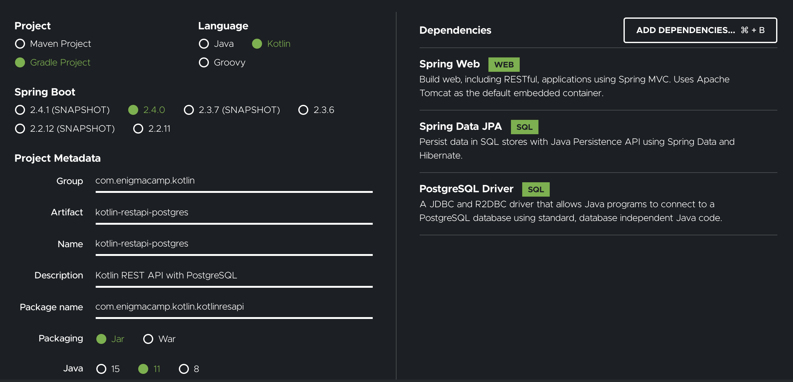
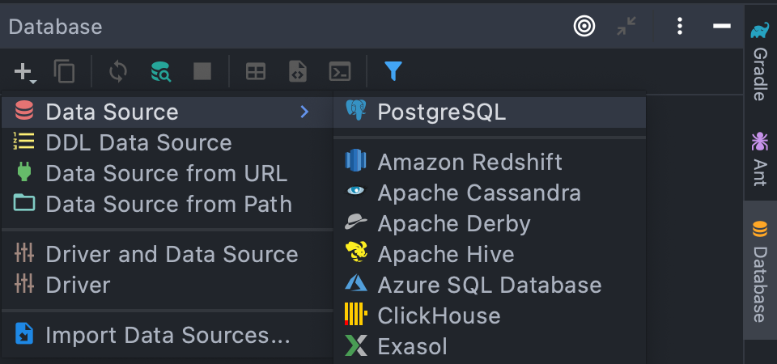
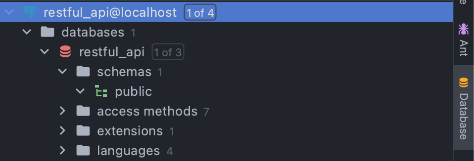

# Simple Kotlin REST API


Start project here : https://start.spring.io/



## Create Db, this db creates with Docker Compose
1. Create a file `docker-compose.yml`
2. Copy this script :
   ```
   version: '3.5'
   
   services:
     kotlin-restful-api-postgres:
       container_name: "kotlin-restful-api-postgres"
       image: postgres:latest
       ports:
         - 5432:5432
       environment:
         POSTGRES_PASSWORD: kotlin
         POSTGRES_USER: kotlin
         POSTGRES_DB: restful-api

   ```
   For default postgres port is `5432`.
3. Type this for process file `docker-compose.yml` :
   ```
   docker-compose -f docker-compose.yml up -d   
    ```
4. Check :
   ```
    docker container ls
    docker container logs kotlin-restful-api-postgres
    ```
5. Open Database in Intellij:


6. Configuration and if successfully:


## API Spec

### Create Customer
- Request: POST
- Endpoint : `/api/customers`
- Header :
    - Content-Type: application/json
    - Accept: application/json
- Body : 
```json
{
    "id": "String",
    "firstName": "String",
    "lastName": "String",
    "address": "String"
}
```

Response:
```json
  {
    "code": "Number",
    "Status": "String",
    "Data": {
          "id": "String",
          "firstName": "String",
          "lastName": "String",
          "address": "String",
          "createdAt": "Date",
          "updatedAt": "Date"
    }     
  }
  ```

### Get Customer
- Request: GET
- Endpoint : `/api/customers/{customerId}`
- Header :
    - Content-Type: application/json

Response:
```json
  {
    "code": "Number",
    "Status": "String",
    "Data": {
          "id": "String",
          "firstName": "String",
          "lastName": "String",
          "address": "String",
          "createdAt": "Date",
          "updatedAt": "Date"
    }     
  }
  ```

### Update Customer
- Request: PUT
- Endpoint : `/api/customers/{customerId}`
- Header :
    - Content-Type: application/json
    - Accept: application/json
- Body :
```json
{
    "firstName": "String",
    "lastName": "String",
    "address": "String"
}
```

Response:
```json
  {
    "code": "Number",
    "Status": "String",
    "Data": {
          "id": "String",
          "firstName": "String",
          "lastName": "String",
          "address": "String",
          "createdAt": "Date",
          "updatedAt": "Date"
    }     
  }
  ```

### List Customer
- Request: GET
- Endpoint : `/api/customers`
- Header :
    - Content-Type: application/json
- Query Param :
    - Size : number,
    - Page : number
    
Response:
```json
  {
    "code": "Number",
    "Status": "String"   
  }
  ```


### Delete Customer
- Request: DELETE
- Endpoint : `/api/customers/{customerId}`
- Header :
    - Content-Type: application/json

Response:
```json
  {
    "code": "Number",
    "Status": "String",
    "Data": [
        {
          "id": "String",
          "firstName": "String",
          "lastName": "String",
          "address": "String",
          "createdAt": "Date",
          "updatedAt": "Date"
        } 
    ]    
  }
  ```
