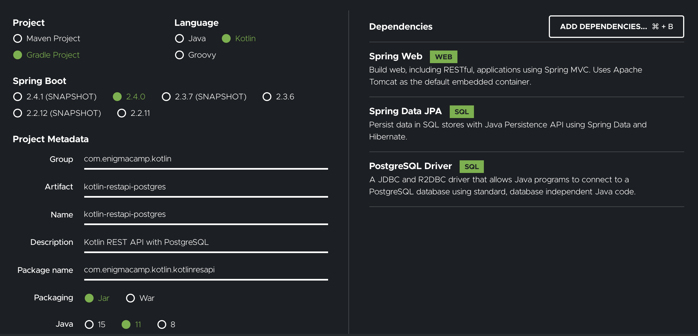
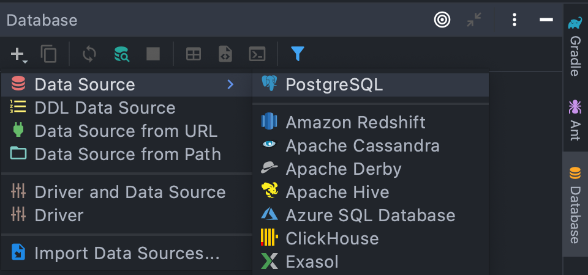
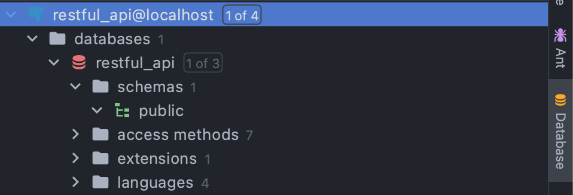

# Simple Kotlin REST API


Start project here : https://start.spring.io/



## Create DB
1. Create database `restful_api` on your PostgreSQL app.
2. Open database in Intellij:


6. Configuration and if successfully:


7. Setting `application.properties`
   ```
    ## default connection pool
    spring.datasource.hikari.connectionTimeout=20000
    spring.datasource.hikari.maximumPoolSize=5
    
    ## PostgreSQL
    spring.datasource.url=jdbc:postgresql://localhost:5432/restful_api
    spring.datasource.username=postgres
    spring.datasource.password=12345qwe
    
    #drop n create table again, good for testing, comment this in production
    spring.jpa.hibernate.ddl-auto=update


    ``` 

## Structure Project
### Create Customer
1. Create a package `entity` in `com.enigmacamp.kotlin.kotlinresapi`
2. Create a class `Customer` in package `entity`
   ```kotlin
   @Entity
   @Table(name = "m_customer")
   data class Customer (
   
           @Id
           @GeneratedValue(generator = "UUID")
           @GenericGenerator(
           name = "UUID",
                   strategy = "org.hibernate.id.UUIDGenerator",
           )
           @Column(name = "id", updatable = false, nullable = false)
           val id: String,
   
           @Column(name = "first_name")
           val firstName: String,
   
           @Column(name = "last_name")
           val lastName: String,
   
           @Column(name = "address")
           val address: String,
   
           @Column(name = "created_at")
           val createdAt: Date,
   
           @Column(name = "updated_at")
           val updatedAt: Date
   )
    ```
3. Create a package `respository` in `com.enigmacamp.kotlin.kotlinresapi`
4. Create a interface `CustomerRepostory`
   ```kotlin
    interface CustomerRepository: JpaRepository<Customer, String> {}
    ```
5. Create a package `model` in `com.enigmacamp.kotlin.kotlinresapi`
6. Create a class `CreateCustomerRequest`
   ```kotlin
    data class CreateCustomerRequest (
    
            val id: String,
    
            val firstName: String,
    
            val lastName: String,
    
            val address: String,
    )
   ```
7. Create a class `CustomerResponse`
   ```kotlin
    data class CustomerResponse (
    
            val id: String,
    
            val firstName: String,
    
            val lastName: String,
    
            val address: String,
    
            val createdAt: Date,
    
            val updatedAt: Date?
    )
   ```
8. Create a package `service` in `com.enigmacamp.kotlin.kotlinresapi`
9. Create a interface `CustomerService`
   ```kotlin
    interface CustomerService {
    
        fun create(createCustomerRequest: CreateCustomerRequest): CustomerResponse
    }
   ```
10. Create a package `impl` in package `service` and create class `CustomerServiceImpl`
       ```kotlin
        @Service
        class CustomerServiceImpl(val customerRepository: CustomerRepository): CustomerService {
        
            override fun create(createCustomerRequest: CreateCustomerRequest): CustomerResponse {
        
                val customer = Customer (
                        id = createCustomerRequest.id,
                        firstName = createCustomerRequest.firstName,
                        lastName = createCustomerRequest.lastName,
                        address = createCustomerRequest.address,
                        createdAt = Date(),
                        updatedAt = null
                )
        
                customerRepository.save(customer);
        
                return CustomerResponse(
                        id = customer.id,
                        firstName = customer.firstName,
                        lastName = customer.lastName,
                        address = customer.address,
                        createdAt = customer.createdAt,
                        updatedAt = customer.updatedAt
                )
            }
        }
       ```
11. Create a package `controller` in package `com.enigmacamp.kotlin.kotlinresapi` and create class `CustomerController`
       ```kotlin
        @RestController
        @RequestMapping(value = ["/api/customers"])
        class CustomerController(val customerService: CustomerService) {
        
            @PostMapping(
                    value = ["/"],
                    produces = ["application/json"],
                    consumes = ["application/json"]
            )
            fun createCustomer(@RequestBody body: CreateCustomerRequest): WebResponse<CustomerResponse> {
                val customerResponse =  customerService.create(body)
                return WebResponse(
                        code = 200,
                        status = "OK",
                        data = customerResponse
                )
            }
        }

       ```    
12. Check Point #1
    
### Create Customer (Validation Input)
1. Create a new package `utils` and create files `ValidationUtil`,`ErrorController`,`NotFoundException`
2. `ValidationUtil`
    ```kotlin
   @Component
   class ValidationUtil(val validator: Validator) {
       fun validate(any: Any) {
           val result =  validator.validate(any);
           if(result.size != 0) {
               throw ConstraintViolationException(result);
           }
   
       }
   }
   ```    
3. `NotFoundException`
    ```kotlin
    class NotFoundException: Exception()  {
    
    }
    ``` 
4. `ErrorController`
    ```kotlin
    @RestControllerAdvice
    class ErrorController {
    
        @ExceptionHandler(value = [ConstraintViolationException::class])
        fun validationHandler(constrainViolationExecption: ConstraintViolationException): WebResponse<String> {
            return WebResponse(
                    code = 400,
                    status = "BAD REQUEST",
                    data = constrainViolationExecption.message!!
            )
        }
    
        @ExceptionHandler(value = [NotFoundException::class])
        fun notFound(notFoundException: NotFoundException): WebResponse<String> {
            return WebResponse(
                    code = 400,
                    status = "NOT FOUND",
                    data = "Not Found"
            )
        }
    }
    ``` 
5. Modify `CreateCustomerRequest`:
   ```kotlin
   @field:NotBlank
   val id: String?,

   @field:NotBlank
   val firstName: String?,

   @field:NotBlank
   val lastName: String?,

   @field:NotBlank
   val address: String?,
   ```      
6. Modify `CustomerServiceImpl`
   ```kotlin
    @Service
    class CustomerServiceImpl(
            val customerRepository: CustomerRepository,
            val validationUtil: ValidationUtil
    ): CustomerService {
    
        override fun create(createCustomerRequest: CreateCustomerRequest): CustomerResponse {
    
            validationUtil.validate(createCustomerRequest);
    
            val customer = Customer (
                    id = createCustomerRequest.id!!,
                    firstName = createCustomerRequest.firstName!!,
                    lastName = createCustomerRequest.lastName!!,
                    address = createCustomerRequest.address!!,
                    createdAt = Date(),
                    updatedAt = null
            )
    
            customerRepository.save(customer);
    
            return CustomerResponse(
                   id = customer.id,
                   firstName = customer.firstName,
                   lastName = customer.lastName,
                   address = customer.address,
                   createdAt = customer.createdAt,
                   updatedAt = customer.updatedAt
            )
        }
   }
    ```       
7. Check Point #2
        
### Get Customer
1. Modify `CustomerService` and add code this
   ```kotlin
    fun get(id: String): CustomerResponse
    ```         
2. Modify `CustomerServiceImpl` like this:
    ```kotlin
     @Service
     class CustomerServiceImpl(val customerRepository: CustomerRepository): CustomerService {
     
         override fun create(createCustomerRequest: CreateCustomerRequest): CustomerResponse {
     
             val customer = Customer (
                     id = createCustomerRequest.id,
                     firstName = createCustomerRequest.firstName,
                     lastName = createCustomerRequest.lastName,
                     address = createCustomerRequest.address,
                     createdAt = Date(),
                     updatedAt = null
             )
     
             customerRepository.save(customer);
     
             return convertCustomerToCustomerResponse(customer);
         }
     
         override fun get(id: String): CustomerResponse {
             val customer = customerRepository.findByIdOrNull(id);
             if(customer == null) {
                 throw NotFoundException();
             } else {
                 return convertCustomerToCustomerResponse(customer);
             }
         }
     
         private fun convertCustomerToCustomerResponse(customer: Customer): CustomerResponse {
             return CustomerResponse(
                     id = customer.id,
                     firstName = customer.firstName,
                     lastName = customer.lastName,
                     address = customer.address,
                     createdAt = customer.createdAt,
                     updatedAt = customer.updatedAt
             )
         }
       }
     ```    
3. Modify `CustomerController` and add code:
   ```kotlin
    @GetMapping(
                value = ["/{customerId}"],
                produces = ["application/json"],
        )
        fun getCustomer(@PathVariable("customerId") id: String): WebResponse<CustomerResponse> {
            val customerResponse = customerService.get(id);
            return WebResponse(
                    code = 200,
                    status = "OK",
                    data = customerResponse
            )
        }
    ```   
4. Check Point #3     

### Update Customer
1. Add a new file `CutomerUpdateRequest` in package `model`
   ```kotlin
    data class UpdateCustomerRequest (
    
        @field:NotBlank
        val firstName: String?,
    
        @field:NotBlank
        val lastName: String?,
    
        @field:NotBlank
        val address: String?,
    )
    ``` 
2. Modify `CustomerService`:
   ```kotlin
   fun update(id: String, updateCustomerRequest: UpdateCustomerRequest): CustomerResponse 
    ```    
3. Modify `Customer`:
   ```kotlin
   @Column(name = "first_name")
   var firstName: String,

   @Column(name = "last_name")
   var lastName: String,

   @Column(name = "address")
   var address: String,

   @Column(name = "created_at")
   var createdAt: Date,

   @Column(name = "updated_at")
   var updatedAt: Date? 
    ```
4. Modify `CustomerServiceImpl`:
   ```kotlin
   override fun update(id: String, updateCustomerRequest: UpdateCustomerRequest): CustomerResponse {
           val customer = customerRepository.findByIdOrNull(id) ?: throw NotFoundException();
   
           validationUtil.validate(updateCustomerRequest);
   
           customer.apply {
               firstName = updateCustomerRequest.firstName!!
               lastName = updateCustomerRequest.lastName!!
               address = updateCustomerRequest.address!!
               updatedAt = Date()
           }
   
           customerRepository.save(customer);
           return convertCustomerToCustomerResponse(customer);
       } 
    ```   
5. Modify `CustomerController`:
   ```kotlin
   @PutMapping(
               value = ["/{customerId}"],
               produces = ["application/json"],
               consumes = ["application/json"]
       )
       fun updateCustomer(@PathVariable("customerId") id: String,
                          @RequestBody updateCustomerRequest: UpdateCustomerRequest): WebResponse<CustomerResponse> {
           val customerResponse = customerService.update(id, updateCustomerRequest)
           return WebResponse(
                   code = 200,
                   status = "OK",
                   data = customerResponse
           )
       } 
    ``` 
6. Check Point #4    

### Delete Customer
1. Modify `CustomerService`:
   ```kotlin
   fun delete(id: String)
    ```    
2. Modify `CustomerServiceImpl`:
   ```kotlin
   override fun delete(id: String) {
           val customer = findCustomerByIdOrThrowNotFound(id);
           customerRepository.delete(customer);
       }
    ```   
5. Modify `CustomerController`:
   ```kotlin
   @DeleteMapping(
               value = ["/{customerId}"],
               produces = ["application/json"]
       )
       fun deleteCustomer(@PathVariable("customerId") id: String): WebResponse<String> {
           customerService.delete(id);
           return WebResponse(
                   code = 200,
                   status = "OK",
                   data = "$id Success Deleted"
           )
       }
    ``` 
6. Check Point #5

### List Customer
1. Add a new file `ListCustomerRequest` in package `model`
   ```kotlin
    data class ListCustomerRequest (
            val page: Int,
    
            val size: Int
    )
    ``` 
2. Modify `CustomerService`:
   ```kotlin
   fun list(listCustomerRequest: ListCustomerRequest): List<CustomerResponse>
    ```    
3. Modify `CustomerServiceImpl`:
   ```kotlin
   override fun list(listCustomerRequest: ListCustomerRequest): List<CustomerResponse> {
           val page = customerRepository.findAll(PageRequest.of(listCustomerRequest.page, listCustomerRequest.size));
           val customers: List<Customer> = page.get().collect(Collectors.toList())
           return customers.map { convertCustomerToCustomerResponse(it) }
       }
    ```   
4. Modify `CustomerController`:
   ```kotlin
   @GetMapping(
               value = [""],
               produces = ["application/json"]
       )
       fun listCustomer(@RequestParam(value = "size", defaultValue = "10") size: Int,
                        @RequestParam(value = "page", defaultValue = "0") page: Int): WebResponse<List<CustomerResponse>> {
           val request = ListCustomerRequest(page = page, size = size);
           val responses = customerService.list(request)
           return WebResponse(
                   code = 200,
                   status = "OK",
                   data = responses
           )
       }
    ``` 
5. Check Point #6  

  
    
## API Spec

### Create Customer
- Request: POST
- Endpoint : `/api/customers`
- Header :
    - Content-Type: application/json
    - Accept: application/json
- Body : 
```json
{
    "id": "String",
    "firstName": "String",
    "lastName": "String",
    "address": "String"
}
```

Response:
```json
  {
    "code": "Number",
    "Status": "String",
    "Data": {
          "id": "String",
          "firstName": "String",
          "lastName": "String",
          "address": "String",
          "createdAt": "Date",
          "updatedAt": "Date"
    }     
  }
  ```

### Get Customer
- Request: GET
- Endpoint : `/api/customers/{customerId}`
- Header :
    - Content-Type: application/json

Response:
```json
  {
    "code": "Number",
    "Status": "String",
    "Data": {
          "id": "String",
          "firstName": "String",
          "lastName": "String",
          "address": "String",
          "createdAt": "Date",
          "updatedAt": "Date"
    }     
  }
  ```

### Update Customer
- Request: PUT
- Endpoint : `/api/customers/{customerId}`
- Header :
    - Content-Type: application/json
    - Accept: application/json
- Body :
```json
{
    "firstName": "String",
    "lastName": "String",
    "address": "String"
}
```

Response:
```json
  {
    "code": "Number",
    "Status": "String",
    "Data": {
          "id": "String",
          "firstName": "String",
          "lastName": "String",
          "address": "String",
          "createdAt": "Date",
          "updatedAt": "Date"
    }     
  }
  ```

### List Customer
- Request: GET
- Endpoint : `/api/customers?size=size&page=page`
- Header :
    - Content-Type: application/json
- Query Param :
    - Size : number,
    - Page : number
    
Response:
```json
  {
    "code": "Number",
    "Status": "String",
    "Data": [
      {
          "id": "String",
          "firstName": "String",
          "lastName": "String",
          "address": "String",
          "createdAt": "Date",
          "updatedAt": "Date"
      },  
      {
        "id": "String",
        "firstName": "String",
        "lastName": "String",
        "address": "String",
        "createdAt": "Date",
        "updatedAt": "Date"
      }  
    ]    
  }
  ```

### Delete Customer
- Request: DELETE
- Endpoint : `/api/customers/{customerId}`
- Header :
    - Content-Type: application/json

Response:
```json
  {
    "code": "Number",
    "Status": "String"
  }
  ```
